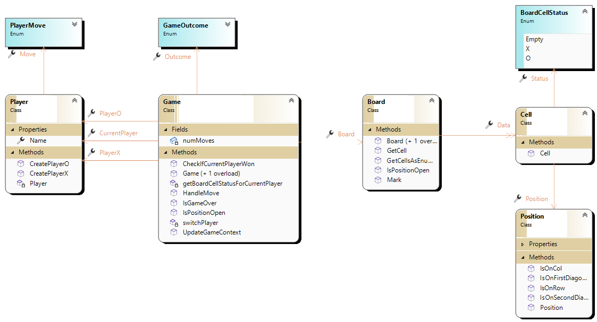

# Tic tac toe Objectified

My attempt at making a tic tac toe model with OOP principles.

The solution is devided into three projects

- ConsoleApp
    - Manages running the game in the console.
- Domain
    - Leeps the types that represent the tic tac toe world.
- Domain.Tests
    - contains the unit tests for the domain.

## Program flow and notes

- The console app project has the TicTacToeConsoleRunner class that drives the game forward.

- Game class contains a board, player x, player o, current player and game outcome.

- When a player marks a cells, we check to see if any row, col of diagonal that the cell belongs to has been won. The logic is in the HandleMove method in the game class.

- Position class has IsOnRow, IsOnCol, IsOnDiagonal methods that facilitate easy query of the cells based on their location.

## Class Diagram

Below is a class diagram of the domain models.

## TODO

- Refine the model 
- Add more tests
- Print game outcome
- Brainstorm/implement more ways to check for win.